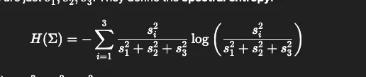

Gaussian parameters:
- Position: (x, y, z)
- Scale: (sx, sy, sz)
- Rotation: quaternion (q0, q1, q2, q3), normalized
- Opacity: alpha ∈ (0,1)
- Color: RGB or SH coeffs

Requirements:

1. Change the cost function, create your own Cost function, not even change. Create your own cost function and show me that you can change the cost function to achieve some purpose. It can be some construction from some paper. I don't care which paper. But you have to have implemented a lot and you need to be able to explain to me the cost function properly. 

2. And then the other thing which is easier is you take two Gaussians, right, and then just do the spectral norm of that, which is basically just running the eigenvector decomposition, or eigenvalue the decomposition on that, and then showing me the eigenvalues and showing me clear differences.

Instead of traditional polygons(mesh) or neural networks like NeRF, Gaussian Splatting uses ellipsoids named as gaussian splats

Each 3D point cloud is converted into Gaussian Splat, with parameters as 

| **Parameter** | **Description** |
| --- | --- |
| **Position (mu)** | The x, y, z coordinates where the splat is centered in 3D space. |
| **Covariance (Sigma)** | A matrix that defines the **shape, size, and orientation** of the ellipsoid (how it's stretched or rotated). |
| **Color** | The color of the splat, often represented using **Spherical Harmonics (SH)** to model how the color changes depending on the viewing direction (view-dependent appearance). |
| **Opacity (alpha)** | The transparency of the splat, crucial for blending multiple overlapping splats. |

Then, Project the 3D Gaussians onto a 2D image plane (splatting & rasterization). 

Loss functions compares original input images to rendered 2D image

Then using Stochastic Gradient Descent or another optimization algorithm, parameters arae adjusted to minimize the loss function

Covariance eigenvalues - s1 s2 s3 

We basically have Spectral entropy as 

- When s1=s2=s3, **spectral entropy is maximized** and condition number is minimized.
- Needle-like artifacts correspond to **low spectral entropy and high condition number**.

So we will penalize gaussians with low entropy

Multiply this spectral loss with spectral lambda and add it to our loss from before

Comparision logs

Without spectral 
step=8799 loss=0.0280 photo=0.0254spec=0.2562 H=0.744 sh=3:  88% 8800/10000 [01:57<00:15, 75.88it/s]Step 8800: 3576 GSs duplicated, 169 GSs split. Now having 235601 GSs.
Step 8800: 3028 GSs pruned. Now having 232573 GSs.
step=8899 loss=0.0225 photo=0.0199spec=0.2559 H=0.744 sh=3:  89% 8896/10000 [01:58<00:14, 76.45it/s]Step 8900: 3589 GSs duplicated, 161 GSs split. Now having 236323 GSs.
Step 8900: 3005 GSs pruned. Now having 233318 GSs.
step=8999 loss=0.0258 photo=0.0232spec=0.2558 H=0.744 sh=3:  90% 9000/10000 [02:00<00:12, 77.09it/s]Step 9000: 3714 GSs duplicated, 155 GSs split. Now having 237187 GSs.
Step 9000: 3114 GSs pruned. Now having 234073 GSs.
step=9099 loss=0.0292 photo=0.0266spec=0.2601 H=0.740 sh=3:  91% 9095/10000 [02:01<00:12, 73.46it/s]Step 9100: 2108 GSs duplicated, 669 GSs split. Now having 236850 GSs.
Step 9100: 40083 GSs pruned. Now having 196767 GSs.
step=9199 loss=0.0284 photo=0.0258spec=0.2536 H=0.746 sh=3:  92% 9199/10000 [02:02<00:10, 75.18it/s]Step 9200: 3823 GSs duplicated, 486 GSs split. Now having 201076 GSs.
Step 9200: 1929 GSs pruned. Now having 199147 GSs.
step=9299 loss=0.0243 photo=0.0217spec=0.2556 H=0.744 sh=3:  93% 9296/10000 [02:04<00:10, 70.01it/s]Step 9300: 3682 GSs duplicated, 296 GSs split. Now having 203125 GSs.
Step 9300: 1851 GSs pruned. Now having 201274 GSs.
step=9399 loss=0.0260 photo=0.0234spec=0.2568 H=0.743 sh=3:  94% 9400/10000 [02:05<00:08, 73.18it/s]Step 9400: 3616 GSs duplicated, 252 GSs split. Now having 205142 GSs.
Step 9400: 2000 GSs pruned. Now having 203142 GSs.
step=9499 loss=0.0258 photo=0.0232spec=0.2574 H=0.743 sh=3:  95% 9496/10000 [02:07<00:06, 72.66it/s]Step 9500: 3542 GSs duplicated, 262 GSs split. Now having 206946 GSs.
Step 9500: 1997 GSs pruned. Now having 204949 GSs.
step=9599 loss=0.0286 photo=0.0260spec=0.2577 H=0.742 sh=3:  96% 9593/10000 [02:08<00:05, 73.44it/s]Step 9600: 3541 GSs duplicated, 232 GSs split. Now having 208722 GSs.
Step 9600: 2059 GSs pruned. Now having 206663 GSs.
step=9699 loss=0.0241 photo=0.0216spec=0.2578 H=0.742 sh=3:  97% 9699/10000 [02:09<00:04, 74.34it/s]Step 9700: 3365 GSs duplicated, 181 GSs split. Now having 210209 GSs.
Step 9700: 2206 GSs pruned. Now having 208003 GSs.
step=9799 loss=0.0258 photo=0.0232spec=0.2578 H=0.742 sh=3:  98% 9795/10000 [02:11<00:02, 70.36it/s]Step 9800: 3343 GSs duplicated, 156 GSs split. Now having 211502 GSs.
Step 9800: 2152 GSs pruned. Now having 209350 GSs.
step=9899 loss=0.0208 photo=0.0182spec=0.2573 H=0.743 sh=3:  99% 9899/10000 [02:12<00:01, 73.01it/s]Step 9900: 3396 GSs duplicated, 161 GSs split. Now having 212907 GSs.
Step 9900: 2170 GSs pruned. Now having 210737 GSs.
step=9999 loss=0.0257 photo=0.0231spec=0.2573 H=0.743 sh=3: 100% 9995/10000 [02:13<00:00, 70.02it/s][CKPT] Saved to /content/results/lantern_spectral/ckpts/train_step9999.pt
[PLY] Saved to /content/results/lantern_spectral/ply/train_step9999.ply
step=9999 loss=0.0257 photo=0.0231spec=0.2573 H=0.743 sh=3: 100% 10000/10000 [02:14<00:00, 74.48it/s]
Training finished in 134.2655611038208 seconds.

Step 8400: 2263 GSs pruned. Now having 195320 GSs.
step=8499 loss=0.0294 photo=0.0247spec=0.0933 H=0.907 sh=3:  85% 8494/10000 [01:49<00:19, 77.97it/s]Step 8500: 2916 GSs duplicated, 112 GSs split. Now having 198348 GSs.
Step 8500: 2389 GSs pruned. Now having 195959 GSs.
step=8599 loss=0.0269 photo=0.0222spec=0.0930 H=0.907 sh=3:  86% 8594/10000 [01:51<00:17, 79.44it/s]Step 8600: 2913 GSs duplicated, 132 GSs split. Now having 199004 GSs.
Step 8600: 2446 GSs pruned. Now having 196558 GSs.
step=8699 loss=0.0265 photo=0.0218spec=0.0932 H=0.907 sh=3:  87% 8693/10000 [01:52<00:16, 77.27it/s]Step 8700: 2972 GSs duplicated, 133 GSs split. Now having 199663 GSs.
Step 8700: 2360 GSs pruned. Now having 197303 GSs.
step=8799 loss=0.0316 photo=0.0270spec=0.0935 H=0.907 sh=3:  88% 8793/10000 [01:53<00:15, 80.08it/s]Step 8800: 2966 GSs duplicated, 132 GSs split. Now having 200401 GSs.
Step 8800: 2432 GSs pruned. Now having 197969 GSs.
step=8899 loss=0.0268 photo=0.0221spec=0.0936 H=0.906 sh=3:  89% 8892/10000 [01:55<00:13, 80.24it/s]Step 8900: 3026 GSs duplicated, 96 GSs split. Now having 201091 GSs.
Step 8900: 2488 GSs pruned. Now having 198603 GSs.
step=8999 loss=0.0294 photo=0.0247spec=0.0937 H=0.906 sh=3:  90% 9000/10000 [01:56<00:12, 77.97it/s]Step 9000: 3001 GSs duplicated, 104 GSs split. Now having 201708 GSs.
Step 9000: 2521 GSs pruned. Now having 199187 GSs.
step=9099 loss=0.0320 photo=0.0272spec=0.0952 H=0.905 sh=3:  91% 9097/10000 [01:57<00:11, 75.41it/s]Step 9100: 1716 GSs duplicated, 528 GSs split. Now having 201431 GSs.
Step 9100: 30777 GSs pruned. Now having 170654 GSs.
step=9199 loss=0.0311 photo=0.0266spec=0.0906 H=0.909 sh=3:  92% 9193/10000 [01:59<00:11, 71.79it/s]Step 9200: 3380 GSs duplicated, 320 GSs split. Now having 174354 GSs.
Step 9200: 1490 GSs pruned. Now having 172864 GSs.
step=9299 loss=0.0270 photo=0.0224spec=0.0921 H=0.908 sh=3:  93% 9299/10000 [02:00<00:09, 77.58it/s]Step 9300: 3223 GSs duplicated, 180 GSs split. Now having 176267 GSs.
Step 9300: 1566 GSs pruned. Now having 174701 GSs.
step=9399 loss=0.0293 photo=0.0247spec=0.0927 H=0.907 sh=3:  94% 9400/10000 [02:01<00:07, 78.88it/s]Step 9400: 3333 GSs duplicated, 144 GSs split. Now having 178178 GSs.
Step 9400: 1685 GSs pruned. Now having 176493 GSs.
step=9499 loss=0.0294 photo=0.0248spec=0.0934 H=0.907 sh=3:  95% 9496/10000 [02:03<00:06, 77.96it/s]Step 9500: 3206 GSs duplicated, 129 GSs split. Now having 179828 GSs.
Step 9500: 1695 GSs pruned. Now having 178133 GSs.
step=9599 loss=0.0309 photo=0.0263spec=0.0935 H=0.906 sh=3:  96% 9596/10000 [02:04<00:05, 75.60it/s]Step 9600: 3248 GSs duplicated, 128 GSs split. Now having 181509 GSs.
Step 9600: 1757 GSs pruned. Now having 179752 GSs.
step=9699 loss=0.0273 photo=0.0226spec=0.0939 H=0.906 sh=3:  97% 9698/10000 [02:05<00:03, 78.51it/s]Step 9700: 3047 GSs duplicated, 113 GSs split. Now having 182912 GSs.
Step 9700: 1748 GSs pruned. Now having 181164 GSs.
step=9799 loss=0.0292 photo=0.0244spec=0.0941 H=0.906 sh=3:  98% 9800/10000 [02:07<00:02, 74.90it/s]Step 9800: 2993 GSs duplicated, 103 GSs split. Now having 184260 GSs.
Step 9800: 1871 GSs pruned. Now having 182389 GSs.
step=9899 loss=0.0242 photo=0.0195spec=0.0941 H=0.906 sh=3:  99% 9900/10000 [02:08<00:01, 74.17it/s]Step 9900: 3115 GSs duplicated, 115 GSs split. Now having 185619 GSs.
Step 9900: 1896 GSs pruned. Now having 183723 GSs.
step=9999 loss=0.0286 photo=0.0239spec=0.0943 H=0.906 sh=3: 100% 9991/10000 [02:09<00:00, 71.29it/s][CKPT] Saved to /content/results/lantern_spectral_lambda/ckpts/train_step9999.pt
[PLY] Saved to /content/results/lantern_spectral_lambda/ply/train_step9999.ply
step=9999 loss=0.0286 photo=0.0239spec=0.0943 H=0.906 sh=3: 100% 10000/10000 [02:10<00:00, 76.84it/s]
Training finished in 130.14166021347046 seconds.